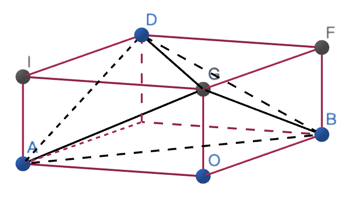
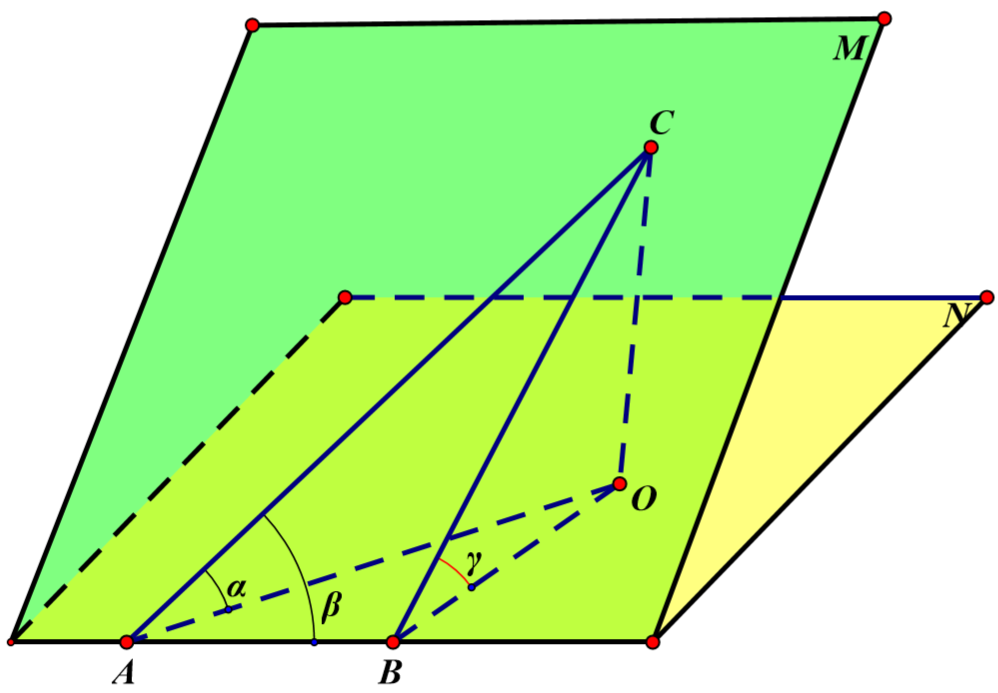

# 立体几何

## 立体几何初步

#### 几何体的表面积和体积

棱锥 $S=S_{侧}+S_{底}$；$V=\dfrac13Sh$

棱台 $S=S_{侧}+S'+S$； $V=\dfrac13(S'+\sqrt{S'S}+S)h$

圆锥 $S=\pi r^2+\pi rl$；$V=\dfrac13\pi r^2h$

圆台 $S=\pi (r'^2+r^2)+\pi(r'+r)l$；$V=\dfrac13\pi(r'^2+r'r+r^2)h$

球 $S=4\pi r^2$；$V=\dfrac43\pi r^3$

#### 正四面体常用公式

面高 $\dfrac{\sqrt{3}}{2}a$，体高 $\dfrac{\sqrt6}{3}a$

表面积 $S=\sqrt3a^2$，体积 $V=\dfrac{\sqrt2}{12}a^3$

外接球半径 $R=\dfrac{\sqrt6}{4}a$，内切球半径 $r=\dfrac{\sqrt6}{12}a$

理解记忆：中心 $O(\overline{x_i},\overline{y_i})$ 即 $(\dfrac{\sum x_i}{4}+\dfrac{\sum y_i}{4})$ $\Rightarrow$ $y_O=\dfrac14y_A=\dfrac{\sqrt6}{12}a$

#### 最短距离问题

展开平面，使得原本不位于同一平面的两点位于同一平面内

例：圆锥 $SO$ 中，底面半径 $r=1$，母线长 $l=4$。 $M$ 为母线 $SA$ 上一个点，$SM=x$ 从 $M$  处拉一根绳子，绕圆锥侧面到 $A$ ，求绳子最短距离

答案：$\sqrt{x^2+16}$

#### 外接球问题

- 补全图形构造长方体
- 找一个面的外心，作垂线，定位球心

例1：

四面体 $ABCD$ 中，$CD=AB=4,BC=AD=2\sqrt3,AC=BD=\sqrt 6$ 求外接球半径 $R$

$$
x^2+y^2=16,y^2+z^2=12,z^2+x^2=6\\
\Rightarrow R=\frac12\sqrt{x^2+y^2+z^2}=\frac{\sqrt{17}}{2}
$$
例2：

已知四棱锥 $P-ABCD$ 的底面 $ABCD$ 为矩形 $AD=1,AB=2$，平面 $PAD$ 垂直于平面 $ABCD$ ,$\triangle PAD$ 是等边三角形，则四棱锥 $P-ABCD$ 的外接球表面积为 ___

答案：$\frac{16}{3}\pi$

---

## 空间位置关系

**确定平面交线**：找出两个公共点

例：$E,F$ 是正方体 $ABCD-A_1B_1C_1D_1$ 的棱 $CC_1,AA_1$ 的中点，试画出平面 $BED_1F$ 与平面 $ABCD$ 的交线。

#### 共线共点共面问题

**证明多点共线问题**

1）先找出两个平面，然后证明这几个点都是这两个平面的公共点.根据基本事实3知，这些点都在这两个平面的交线上.

2） 选择其中两点确定一条直线，然后证明其他点也在该直线上

**证明三线共点问题**

先证明两条直线交于一点，再证明第三条直线过该点，如证明该点在不重合的两个平面内，故该点在它们的交线（第三条直线）上，从而证明三线共点

**证明空间直线共面问题**

1） 纳入平面法：先证明某些点和直线在一个确定的平面内，再证明其余的点和直线也在这个确定的平面内.

2）辅助平面法（平面重合法）：先证明某些点和直线在一个确定的平面内，另一些点和直线在另外一个确定的平面内，最后证明这些平面重合.

3）反证法.可以假设这些点和直线不在同一个平面内，然后通过推理找出矛盾，从而否定假设，肯定结论。

**判定异面直线**的常用方法：过平面外一点与平面内一点的直线，和平面内不经过该点的直线是异面直线

#### 平行与垂直

判定&性质定理

求异面直线所成的角

求线面角

求二面角

辅助线思路：能连不取，能取不作，能作线线不做线面。

求空间距离

#### 截面问题

基本方法：两点成线相交法/平行法

#### 空间向量

基本运算

投影：向量 $\boldsymbol{a}$ 在向量 $\boldsymbol{b}$ 上的投影向量 $\boldsymbol{c}=|\boldsymbol{a}|\cos\braket{\boldsymbol{a},\boldsymbol{b}}\dfrac{\boldsymbol{b}}{|\boldsymbol{b}|}$

证明空间三点共线/证明空间四点 $A,B,P,M$ 共面

### 拓展内容

**三正弦定理**

$\sin \alpha=\sin\gamma\cdot\sin\beta$

例题： 

四棱锥 $P-ABCD$ 底面为正方形，$PD\perp ABCD$。 设平面 $PAD$ 交平面 $PBC$ 于 $l$ 

(1) 证明 $l\perp 平面PDC$

(2) 若 $PD=AD=1$，$Q$ 是 $l$ 上一点，求 $PB$ 与平面 $QCD$ 所成角正弦值最大值。

解：

法一：向量法

法二：三正弦定理

**向量叉乘**

$\vec a\times\vec b=\begin{vmatrix}\vec i&x_a&x_b\\\vec{j}&y_a&y_b\\\vec{k}&z_a&z_b\end{vmatrix}=(y_az_b-y_bz_a)\vec i+(z_ax_b-z_bx_a)\vec{j}+(x_ay_b-x_by_a)\vec k$

几何意义：

方向：垂直于 $\vec a,\vec b$ 平面，由右手螺旋定则确定

大小：$|\vec a\times\vec b|$ 等于以这两个向量为边长的平行四边形的面积

应用：

- 求三角形面积
- 求法向量
