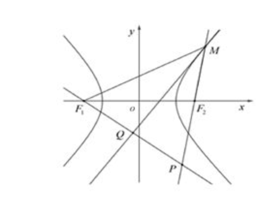
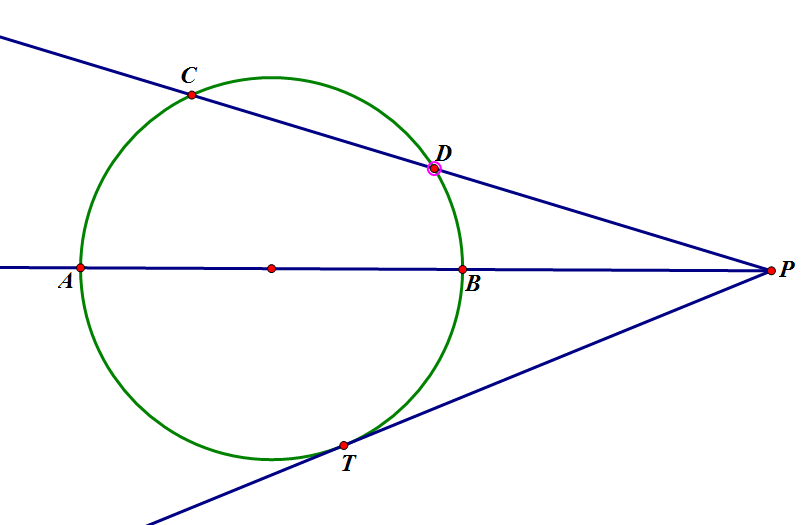
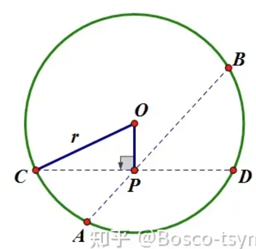
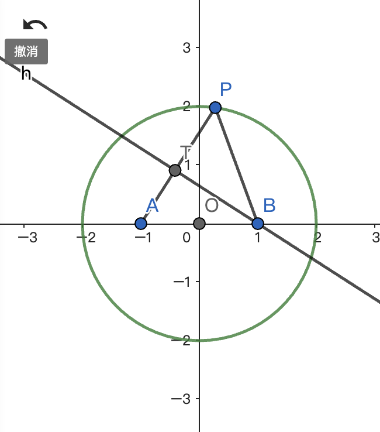
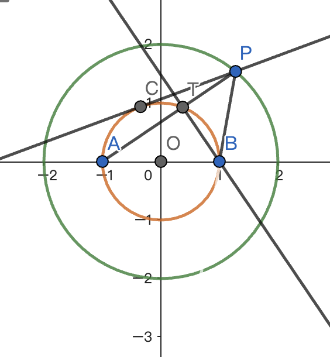
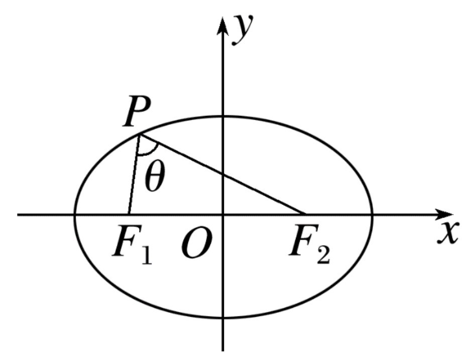
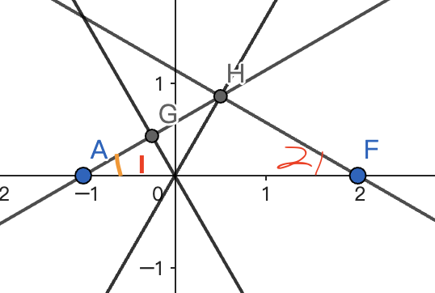
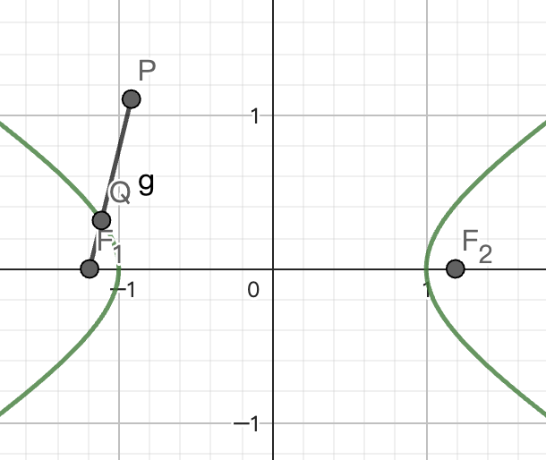
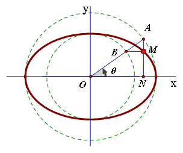

# 直线与圆

直线方程 $Ax+By+C=0$ 

点斜式 $y-y_0=k(x-x_0)$

两点式 $\dfrac{y-y_1}{x-x_1}=\dfrac{y_2-y_1}{x_2-x_1}$

截距式 $\dfrac xA+\dfrac yB=1$

判断：

1. 若两条直线方程组成的方程组有解，则两直线相交 （$\qquad$）
2. $l_1:A_1x+B_1y+C_1=0$ 与 $l_2:A_2x+B_2y+C_2=0$ 平行 $\Leftrightarrow$ $\left\{\begin{aligned}A_1B_2-A_2B_1=0\\A_1C_2-A_2C_1\neq 0\end{aligned}\right.$ （$\qquad$）

$\times$ $\times$ 

$A_1C_2-A_2C_1\ne 0 $ 或 $ B_1C_2-B_2C_1\ne 0$ 。（考虑 $y+1=0,y+2=0$）

点到直线距离公式 $\dfrac{|Ax+By+C|}{\sqrt{A^2+B^2}}$

已知直线经过 $(1,2)$， 与 $(2,3)$ 和 $(0,-5)$ 距离相等，则此直线的方程为（$\qquad$）

$x=1$ 或 $4x-y-2=0$

已知 $A(x_1,y_1),B(x_2,y_2)$ 是圆 $x^2+y^2=1$ 上两点，$\ang AOB=\dfrac{\pi}{2}$，求 $|x_1+y_1-1|+|x_2+y_2-1|$ 最大值

4

已知 $A(x_1,y_1),B(x_2,y_2)$ 是椭圆 $4x^2+y^2=1$ 上两点，$4x_1x_2+y_1y_2=\dfrac 12$，求 $|2x_1+y_1-1|+|2x_2+y_2-1|$ 最大值

$2+\sqrt 6$

hint: 

令 $m_1=2x_1,n_1=y_1$

$M(m_1,n_1),N(m_2,n_2)\Rightarrow OM=ON=1$

$\overrightarrow{OM}\cdot \overrightarrow{ON}\Rightarrow\theta=\dfrac{\pi}{3}$ 

**对称问题**

点 $(x_0,y_0)$ 关于直线 $Ax+By+C$ 对称得到的点 $(x_1,y_1)$ 满足：

$\left\{\begin{aligned}&\dfrac{y_1-y_0}{x_1-x_0}=\dfrac{B}{A}\\&A\cdot \dfrac{x_1+x_0}{2}+B\cdot\dfrac{y_1+y_0}{2}+C=0\end{aligned}\right.$

例：

将坐标纸折叠一次，使得 $(0,2)$ 与 $(4,0)$ 重合，$(7,3)$ 与 $(m,n)$ 重合，则 $m+n=$ （$\qquad$）

直线 $2x-4y-1=0$  关于 $x+y=0$ 对称的直线方程为：（$\qquad$）

$\dfrac{34}{5},4x-2y-1=0$（相关点法）

**直线系**

直线系：满足某种共同性质的直线的集合

斜率 $k$ 相同：$y=kx+t$ ，$t$ 为参数

过定点：$A(x-x_0)+B(y-y_0)=0$ ，$A,B$ 不同时为零

到定点距离为定值 $r$：（以原点为例）$r\cos\theta\cdot x+r\sin\theta\cdot y=r^2\Leftrightarrow \dfrac{x\cos\theta}{r}+\dfrac{y\sin\theta}{r}=1$

**圆的方程**

标准方程 $(x-a)^2+(y-b)^2=r^2$ 一般方程 $x^2+y^2+Dx+Ey+F=0$ 圆心 $(-\dfrac D2,-\dfrac E2 )$

**求解以线段为直径的圆**

1. 求出圆心，计算半径
2. 向量法 $\overrightarrow{AP}\cdot\overrightarrow{BP}=0$

**特殊类型圆**

- **阿氏圆**

​	$\dfrac{|PA|}{|PB|}=\lambda>0,\lambda\neq 1\Rightarrow$ $P$ 轨迹是个圆 且 $|OP|^2=|OA|\cdot |OB|$

- 距离平方和为定值 $a|PA|^2+b|PB|^2=c$

**轨迹问题 **

- 直接法（翻译题目条件）
- 几何法
- 相关点法 （用未知点坐标表示出已知轨迹点的坐标，然后利用已知轨迹构造等量关系）
- 交轨法（两条曲线，消去参数，得到交点轨迹）

例1：$P$ 是 $A:(x-4)^2+y^2=4$ 上一动点，$Q$ 为 $B:(x-6)^2+(y-4)^2=1$ 上一动点，$O$ 为坐标原点，则 $|PO|+|PQ|+|PB|$ 最小值为（$\qquad$）

9

例2: $A(-2,0),B(2,0)$ $P$ 点满足 $k_{PA}\cdot k_{PB}=-\frac 14$ 求 $P$ 点轨迹

$\dfrac{x^2}{4}+y^2=1(y\ne 0)$

例3: 设 $F_1,F_2$ 是双曲线 $\dfrac{x^2}{a^2}-\dfrac{y^2}{b^2}=1$ 的左右焦点，$M$ 是双曲线右支上任意一点，过 $F_1$ 作 $\ang F_1MF_2$ 平分线的垂线，垂足为 $Q$ 则 $Q$ 点轨迹方程为 （$\qquad$）

$x^2+y^2=a^2$

Hint: 遇中点，找中位线

例4：直线 $l$：$y=k(x+4),k\in\R$ 与 圆 $(x+2)^2+y^2=4$ 相交于 $A,B$ 两点，$M$ 是线段 $AB$ 中点，$M$ 的轨迹方程为：

$(x+3)^2+y^2=1(x\neq -4)$

例5: $M,N$ 是圆 $O:x^2+y^2=4$ 上两点，$P(1,2),\overrightarrow{PM}\cdot\overrightarrow{PN}=0$ 则 $|MN|_{\min}=$ （$\qquad$）

hint: 利用 $r_O=2$ 求出 $Q$ 轨迹

$\sqrt 5-\sqrt 3$

例6：已知正方形的四个项点分别为 $O(0,0),A(1,0),B(1,1),C(0,1)$，点 $D,E$ 分别在线段 $OC,AB$ 上运动，且 $OD=BE$，设 $AD$ 与 $OE$  交于点 $G$，则点 $G$ 的轨迹方程是

$\left\{\begin{aligned}y&=(1-t)x\quad&(0\le x\le 1)\\y&=-tx+t\quad&(0\le x\le1)\end{aligned}\right.$

$\Rightarrow\left\{\begin{aligned}x&=t\\y&=(1-t)t\end{aligned}\right.$

$y=(1-x)x\quad(0\le x\le1)$

**数形结合解圆有关最值**

1. $\dfrac{y-b}{x-a}$ 型 $\Rightarrow$ 斜率
2. $ax+by\Rightarrow$ 动直线截距
3. $(x-a)^2+(y-b)^2\Rightarrow$ 到定点距离  

例：$P(x,y)$ 在圆 $C:x^2+y^2-6x-6y+14=0$ 上，求以下式子的$\min/\max$

(1) $\dfrac yx$ (2) $x^2+y^2+2x+3$ (3) $x+y$

答案：(1) $\dfrac{9\pm2\sqrt{14}}{5}$ (2) $11,51$ (3) $6\pm2\sqrt 2$

**判定圆与直线位置关系**

推荐几何法：判断 $d=\dfrac{|Ax+By+C|}{\sqrt{A^2+B^2}}$ 与 $r$ 的大小关系

---

**求弦长**

1. $2\sqrt{r^2-d^2}$ 
2.  $\sqrt{1+k^2}|x_1-x_2|$ 或 $\sqrt{1+\dfrac 1{k^2}}|y_1-y_2|$

---

**求切线**

$P$ 在圆上：

$(x-a)(x_1-a)+(y-b)(y_1-b)=r^2$；

$x_1x+y_1y+D\cdot \dfrac{x_1+x}{2}+E\cdot\dfrac{y_1+y}{2}+F=0$

不在圆上：

先判断斜率不存在的情况，然后待定斜率 $k$ 设直线方程 $y-y_1=k(x-x_1)$，求 $d$.

**求切点弦**

同构 $\Rightarrow x_0x+y_0y=r^2$ （形式与切线相同）

---

**两圆公共弦**

作差，消去二次项

$(D_1-D_2)x+(E_1-E_2)y+F_1-F_2=0$

例：求 $C_1:x^2+y^2-2x+10y-24=0$ 与 $C_2:x^2+y^2+2x+2y-8=0$ 公共弦 $AB$ 的长

$2\sqrt{r^2-d^2}=2\sqrt 5$

---

**圆系方程**

过 $Ax+By+C=0$ 与 $x^2+y^2+Dx+Ey+F=0$ 的交点的圆系方程：$x^2+y^2+Dx+Ey+F+\lambda(Ax+By+C)=0,\lambda\in\R$

过 $x^2+y^2+D_1x+E_1y+F_1=0$ 和 $x^2+y^2+D_2x+E_2y+F_2=0$ 的交点的圆系方程为：$x^2+y^2+D_1x+E_1y+F_1+\lambda(x^2+y^2+D_2x+E_2y+F_2)=0$ 不包括圆2

例：求圆心在直线 $x-y-4=0$ 上，且经过两圆 $x^2+y^2-4x-6=0$ 和 $x^2+y^2-4y-6=0$ 的交点的圆的方程

$x^2+y^2-4x-6+\lambda(x^2+y^2-4y-6)=0\Leftrightarrow x^2+y^2-\dfrac{4}{1+\lambda}x-\dfrac{4\lambda}{1+\lambda}y-6=0$

圆心 $\left(\dfrac{2}{1+\lambda},\dfrac{2\lambda}{1+\lambda}\right)$ 在 $x-y-4=0$ 上

解得 $\lambda=-\dfrac 13$ 

圆方程：$x^2+y^2-6x+2y-6=0$

---

**圆幂定理**

割线定理 & 切割线定理

$|PA|\cdot |PB|=|PC|\cdot |PD|=|PT|^2=|OP|^2-R^2$ （圆幂）

证：$\ang PTB=\ang PAT,\ang TPB=\ang APT\Rightarrow \triangle PBT\sim\triangle PTA\Rightarrow |PT|^2=|PA|\cdot |PB|$

相交弦定理

$|PA|\cdot |PB|=|PC|\cdot|PD|=||OP|^2-r^2|$

证：相似

例：$A(-1,0),B(1,0)$ ，$P$ 是 $O:x^2+y^2=4$ 上任意一点（不在 $x$ 轴上），过 $B$ 作 $BT\perp AP$ 于 $T$。 则 $2|PA|+3|PT|$ 的最小值是（$\qquad$）

$|PA|\cdot |PT|=|PC|^2=3$

$2|PA|+3|PT|\ge 2\sqrt{2|PA|\cdot 3|PT|}=6\sqrt 2$ 取等条件：$|PA|=\dfrac{3\sqrt 2}{2}$

法二：

$\overrightarrow{PO}=\dfrac 12(\overrightarrow{PA}+\overrightarrow{PB})\Rightarrow|PO|^2=\dfrac 14(|PA|^2+|PB|^2+2|PA|\cdot|PB|\cos\ang APB)$

又 $\cos\ang APB=\dfrac{|PA|^2+|PB|^2-|AB|^2}{2|PA||PB|}$

所以 $|PO|=\dfrac 12\sqrt{2(|PA|^2+|PB|^2)-|AB|^2}=2$ 

又 $|AB|=2$  所以 $|PA|^2+|PB|^2=10$ ，$\cos\ang APB=\dfrac{3}{|PA||PB|}$

$|PT|=|PB|\cdot\cos\ang APB=\dfrac 3{|PA|}$

$2|PA|+3|PT|=2|PA|+\dfrac 9{|PA|}\ge 6\sqrt 2$

# 圆锥曲线

## 几个定义

### 标准方程：

椭圆 $\dfrac{x^2}{a^2}+\dfrac{y^2}{b^2}=1,a>b>0$ 或 $\dfrac{x^2}{b^2}+\dfrac{y^2}{a^2}=1,a>b>0$ $(c=\sqrt{a^2-b^2})$

双曲线 $\dfrac{x^2}{a^2}-\dfrac{y^2}{b^2}=1,a>0,b>0$ 或 $\dfrac{y^2}{a^2}-\dfrac{x^2}{b^2}=1,a>0,b>0$ $(c=\sqrt{a^2+b^2})$

抛物线 $y^2=2px$ / $y^2=-2px$ / $x^2=2py$ / $x^2=-2py$

### 第二定义：

到定点的距离与定直线距离比值为定值的点的轨迹是圆锥曲线，其中定点即为焦点，定直线为准线，定值为离心率 $e=\dfrac rh$

抛物线准线 $x=\frac12p$ 

椭圆/双曲线准线 $x=\dfrac{a^2}{c}$ 

试试用标准方程证明第二定义

应用：

1. 例：$C:\dfrac{x^2}{2}+y^2=1$ 右焦点为 $F$ ，过 $F$ 的直线与 $C$ 交于 $A,B$ ，$M(2,0)$ 证明：$\ang OMA=\ang OMB$

2. 焦半径公式 

   椭圆（$F_1,F_2$为左右焦点） $|PF_1|=a+ex_0,|PF_2|=a-ex_0$ 

   双曲线 $|PF_2|=|ex_0-a|,|PF_2|=|ex_0+a|$

   抛物线 $|PF|=x_0+\dfrac p2$

例：$F_1,F_2$ 为 $\dfrac{x^2}{4}+\dfrac{y^2}{3}=1$ 的左右焦点，过 $F_1$ 的直线 $l_1$ 与过 $F_2$ 的直线 $l_2$ 交于点 $N$ ，$M$ 为 $F_1N$ 中点，$F_1N$ 的中垂线 $MP$ 与 $l_2$ 的交点 $P$（第一象限） 在椭圆上，则 $|OM|$ 的取值范围是：

ans: $(0,1)$

hint: 

中垂线：找等腰三角形

$|OM|=\dfrac 12 |F_2N|=\dfrac 12(|PF_1|-|PF_2|)$

### 第三定义

到两定点斜率乘积为定值的点的轨迹是圆/椭圆/双曲线（去掉两点）。

$k_1\cdot k_2=e^2-1$

### 极坐标系下的统一方程

a.k.a. 焦半径公式

$\rho=\dfrac{ep}{1-e\cos\theta},e为离心率,p为焦准距$

1. 试试直接证明 $\rho=\dfrac{b^2}{a-c\cos\theta}$ / $\rho=\dfrac{p}{1-\cos\theta}$ 
2. 利用焦半径公式 $\rho=\dfrac{ep}{1-e\cos\theta}$ 证明圆锥曲线最短焦点弦长度为 $2ep$ （通径）

例1：若双曲线 $\dfrac{x^2}{a^2}-\dfrac{y^2}{b^2}=1(a>0,b>0)$ 的焦点到渐近线的距离等于实轴长，则双曲线离心率为($\qquad$)

 $\sqrt{5}$ 

实轴长：$2a$ 

例2：已知椭圆 $C$ 的焦点为 $F_1(-1,0),F_2(1,0)$，过 $F_2$ 的直线与 $C$ 交于 $A,B$ 两点. 若 $|AF_2|=2|F_2B|$， $|AB|=|BF_1|$，则 $C$ 的方程为

 $\dfrac{x^2}{3}+\dfrac{y^2}{2}=1$

例3: $F$ 是 $\dfrac{x^2}4-\dfrac{y^2}{12}=1$ 的左焦点，$A(1,4)$ ，$P$ 是右支上动点，求 $\{|PF|+|PA|\}_{\min}$

9

例3: 已知 $F_1$，$F_2$ 分别为双曲线 $\dfrac{x^2}{a^2}-\dfrac{y^2}{b^2}=1(a>0,b>0)$ 的左、右焦点，$P$ 为双曲线上一点，$PF_2$ 与 $x$ 轴垂直，$\ang PF_1F_2=30^\circ$，且虚轴长为 $2$ ，则双曲线的标准方程为

 $2x^2-y^2=1$

### 一些二级结论

#### 切线

求切线方程：${x^2}\mapsto x_0x$ ，$x\mapsto \dfrac{x+x_0}2$ ， $xy\mapsto \dfrac{x_0y+y_0x}{2}$

证明：

二次曲线 $Ax^2+Bxy+Cy^2+Dx+Ey+F=0$ 

对 $x$ 求导：$2Ax+By+Bxy'+2Cyy'+D+Ey'+F=0$

$x_0$ 处 $2Ax_0+By+Bx_0y'+2Cy_0y'+D+Ey'+F=0$ 可求出 $y'$

代入过 $(x_0,y_0)$ 的直线方程：$y'(x-x_0)=y-y_0$

整理一下 
$$
(Bx_0+2Cy_0+E)(y-y_0)+(2Ax_0+By_0+D)(x-x_0)=0
$$

又 

$$
Ax_0^2+Bx_0y_0+Cy_0^2+Dx_0+Ey_0+F=0
$$

$(1)+2(2)\Rightarrow$ $2Ax_0x+By_0x+Bx_0y+2Cy_0y+Dx+Dx_0+Ey+Ey_0+2F=0$

具体地

圆 $x_0x+y_0y+D\cdot \dfrac{x+x_0}{2}+E\cdot \dfrac{y+y_0}{2}+F=0$

椭圆 $\dfrac{x_0x}{a^2}+\dfrac{y_0y}{b^2}=1$

双曲线 $\dfrac{x_0x}{a^2}-\dfrac{y_0y}{b^2}=1$

抛物线 $y_0y=p(x+x_0)$

**切点弦**

同构，形式上与切线相同

**切线的几何意义 "光学性质"**

椭圆：$\ang F_1PF_2$ 的外角平分线

双曲线：$\ang F_1PF_2$ 的平分线

抛物线：$\ang FPH$ 的平分线，其中 $PH\perp$ 准线于 $H$

证明：

代数法：求出夹角正切值 $\tan \theta=\tan(\alpha+\beta)=\dfrac{k_1+k_2}{1-k_1k_2}$

几何法：对称，将军饮马 或 微元法 $\mathrm{d} r=\mathrm{d}x\cdot \cos\theta,\mathrm{d}r_1+\mathrm{d}r_2=0$

#### 焦点三角形 $\triangle PF_1F_2$

研究方法：利用定义 $|PF_1|\pm|PF_2|=2a$ ，加上余弦定理/正弦定理

椭圆

- $a-c\le |PF_1|\le a+c$

- 面积：$S=b^2\tan\dfrac\theta 2=c\cdot |y_P| \Rightarrow$ $P$ 位于 $y$ 轴时 $\theta$ 取最大值

  证明：运用余弦定理，计算出 $|PF_1|\cdot |PF_2|$

- $e=\dfrac{|F_1F_2|}{|PF_1|+|PF_2|}=\dfrac{\sin \theta}{\sin\alpha+\sin\beta}=\dfrac{\sin(\alpha+\beta)}{\sin\alpha+\sin\beta}$

- $|PF_1|\cdot|PF_2|\le\left(\dfrac{|PF_1|+|PF_2|}{2}\right)^2=a^2$

- 旁切圆圆心在直线 $x=a$ 或 $x=-a$ 上。证明：运用切线长定理

双曲线

- 面积 $S=\dfrac{b^2}{\tan\dfrac\theta 2}=c\cdot |y_P|$
- $e=\dfrac{\sin(\alpha+\beta)}{\sin\alpha-\sin\beta}$
- 内切圆圆心在直线 $x=a$ 或 $x=-a$ 上。

例：

双曲线 $C:\dfrac{x^2}{a^2}-\dfrac{y^2}{b^2}=1(a>0,b>0)$ 的左右焦点为 $F_1,F_2$ ，$A$ 为双曲线右支上一点，设 $\ang AF_1F_2=\alpha,\ang AF_2F_1=\beta$，若 $\dfrac{\sin\alpha\sin\beta}{(1+\cos\alpha)(1-\cos\beta)}=\dfrac 12$ 则双曲线的渐近线方程为：

ans: $y=\pm2\sqrt 2x$

hint: 

条件变形 $\Rightarrow \dfrac{\tan\dfrac\alpha 2}{\tan\dfrac\beta 2}=\dfrac 12$（齐次三角函数转换为 $\tan$）

法一：
$$
\begin{aligned}
e&=\dfrac{\sin(\alpha+\beta)}{\sin\beta-\sin\alpha}=\dfrac{2\sin\dfrac{\alpha+\beta}{2}\cdot{\cos\dfrac{\alpha+\beta}{2}}}{2\cos\dfrac{\beta+\alpha}{2}\cdot\sin\dfrac{\beta-\alpha}{2}}=\dfrac{\sin\dfrac{\alpha+\beta}{2}}{\sin \dfrac{\beta-\alpha}{2}}\\&=\dfrac{\tan \dfrac\alpha 2+\tan\dfrac \beta 2}{\tan\dfrac\beta2-\tan\dfrac\alpha2}=\dfrac{1+2}{2-1}=3
\end{aligned}
$$

类似地，对于椭圆，有 $e=\dfrac{1-\tan\dfrac\alpha2\cdot\tan\dfrac\beta2}{1+\tan\dfrac\alpha2\cdot\tan\dfrac\beta2}$

法二：

看到 $\dfrac \alpha 2,\dfrac \beta 2$ ，想到三角形内心 $I$

$\dfrac{c+a}{c-a}=\dfrac 21\Rightarrow e=3$

### 抛物线焦点弦结论

### 联立公式

$$
\left\{\begin{aligned}&\dfrac{x^2}{m}+\dfrac{y^2}{n}=1\\&Ax+By+C=0\end{aligned}\right.\\
\Rightarrow\left\{\begin{aligned}&\Delta=4mn(A^2m+B^2n-C^2)\\
&|x_1-x_2|=|B|\cdot\dfrac{\sqrt\Delta}{A^2m+B^2n}\\
&|y_1-y_2|=|A|\cdot\dfrac{\sqrt\Delta}{A^2m+B^2n}\end{aligned}\right.
$$

$\Rightarrow$ 求 $x_1,x_2$ / 判断直线与椭圆的位置关系

用于写大题求切线过程

### 离心率问题

- 通过定义/二级结论/几何法直接求出 $a,b$
- 求出边的长度，解三角形构造齐次方程
- 解出点的坐标，代入定义式（e.g.$\dfrac{x^2}{a^2}+\dfrac{y^2}{b^2}=1$）

例1: 已知 $F$ 是椭圆 $\dfrac{x^2}{a^2}+\dfrac{y^2}{b^2}=1,a>b>0$ 的右焦点，过椭圆 $C$ 的下顶点且斜率为 $\dfrac 34$ 的直线与以点 $F$ 为圆心、半焦距为半径的圆相切，则椭圆 $C$ 的离心率为

$\dfrac{\sqrt 5}{5}$

例2: $F,A$ 分别是 $C:\dfrac{x^2}{a^2}-\dfrac{y^2}{b^2}=1$ 的右焦点和左顶点，过 $F$ 作 $FH\perp$ 渐近线于 $H$，$|HA|=|HF|$，则 $C$ 的离心率为

ans: 2

法一：$\cos\ang HFO=\dfrac bc=\dfrac{b^2+(a+c)^2-b^2}{2\cdot b\cdot (a+c)}(考虑\triangle HFA)$

法二：

$HF=HA\Rightarrow\ang1=\ang2$

渐近线对称 $\Rightarrow$  $\ang AOG=\ang FOH$

所以 $\triangle AOG\sim \triangle FOH\Rightarrow OH\perp AH$

又 $OA=HO=a$ 故 $OG$ 平分 $\ang AOH\Rightarrow60^\circ$

例3: $\ang PF_2F_1=45^\circ,\ang PF_1F_2=75^\circ$ ，求 $e$

$\dfrac{\sin 60^\circ}{\sin 45^\circ+\sin 75^\circ}=\dfrac{\frac{\sqrt{3}}{2}}{\frac{\sqrt 2}2+\frac{\sqrt 6-\sqrt 2}{4}}=\dfrac{\sqrt 6-\sqrt 2}{2}$

例4：已知 $F_1,F_2$ 分别为 $C:\dfrac{x^2}{a^2}-\dfrac{y^2}{b^2}=1$ 的左右焦点，$P$ 在第二象限内，$|F_1P|=a,(\overrightarrow{F_2P}+\overrightarrow{F_2F_1})\cdot\overrightarrow{F_1P}=0,F_1P$ 交$C$ 于 $Q,|F_1P|=3|F_1Q|$，则 $C$ 的离心率为（$\qquad$）

$F_2$ 在 $F_1P$ 的中垂线上 $\cos\ang PF_1F_2=\dfrac{\frac{a}{2}}{2c}=\dfrac a{4c}$

又 $|F_1Q|=\dfrac 13|F_1P|=\dfrac a3,|F_2Q|=\dfrac a3+2a=\dfrac 73 a$

$\cos \ang PF_1F_2=\dfrac{(\frac a3)^2+(2c)^2-(\frac 73a)^2}{2\cdot (\frac a3)\cdot 2c}=\dfrac a{4c}$

$\Rightarrow e=\dfrac ca=\dfrac{\sqrt{51}}{6}$

### 中点弦问题

**点差法**

$\left\{\begin{aligned}\dfrac{x_1^2}{a^2}+\dfrac{y_1^2}{b^2}=1\\\dfrac{x_2^2}{a^2}+\dfrac{y_2^2}{b^2}=1\end{aligned}\right.\Rightarrow M(\dfrac{x_1+x_2}{2},\dfrac{y_1+y_2}{2})$

$k_{OM}\cdot k_{AB}=e^2-1$

另一种理解：中位线

例：已知直线 $l$ 与椭圆 $\dfrac {x^2}4+\dfrac {y^2}3$ 相交于 $A,B$ 两点，且线段 $AB$ 的中点$P(1,1)$.
(1) 求直线 $l$ 的方程
(2) 求 $S_{\triangle OAB}$ 的面积

$3x+4y-7=0$
$|AB|=\dfrac{5\sqrt{105}}{21},d=\dfrac 75,S=\dfrac{\sqrt{105}}6$

$x+2y-3=0$

### 椭圆三角换元

解决椭圆上的点的最值问题

设 $M$ 是 $\dfrac{x^2}{a^2}+\dfrac{y^2}{b^2}=1$ 上一点

$\dfrac{x^2}{a^2}+\dfrac{y^2}{b^2}=1\Rightarrow\left(\dfrac xa\right)^2+\left(\dfrac yb\right)^2=1$

令 $\left\{\begin{aligned}\cos\theta=\dfrac xa\\\sin\theta=\dfrac yb\end{aligned}\right.$ 则 $M(a\cos\theta,b\sin\theta)$，其中 $\theta$ 为离心角（不是 $l_{OM}$ 倾斜角！）

例： 求 $x^2+8y^2=8$ 上一点 $P$ 使其到 $l:x-y+4=0$ 距离最短

